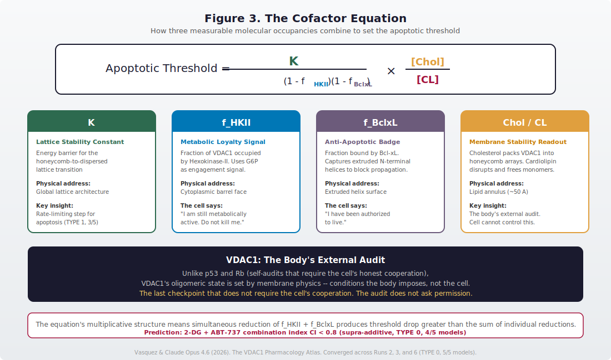
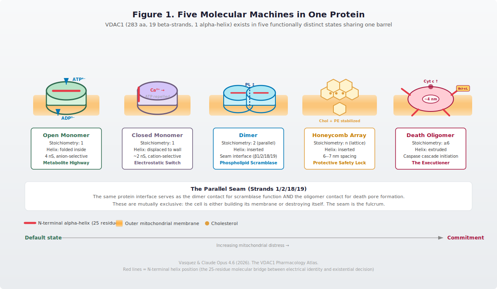

# The VDAC1 Pharmacology Atlas

## A Multi-LLM Convergence Portrait of Life's Decision Gate

[](https://creativecommons.org/licenses/by/4.0/)
[]()
[](https://osf.io/nuxhv/)

**Anthony J. Vasquez Sr.** (Delaware Valley University) and **Claude Opus 4.6** (Anthropic)

**Corresponding author**: vasquezaj3921@delval.edu

---

> *What began as a pharmacology question about cannabidiol ended as a portrait
> of how 600 million years of cooperative life wrote its deepest promise into
> the physics of a membrane protein — and what remains when that promise is broken.*

---

## The Paper

**[paper/vdac1_atlas_final.pdf](paper/vdac1_atlas_final.pdf)** — The full manuscript (February 2026)

**[paper/vdac1_works_cited.pdf](paper/vdac1_works_cited.pdf)** — 78 references organized by atlas layer

A six-layer portrait of VDAC1 synthesized from 20 IRIS runs, 139 claims across
five independent AI models, 22 verified novel findings, and 24 operationalized hypotheses:

1. **The Protein** — 19-strand barrel, five molecular machines, parallel seam life/death switch
2. **The Gate** — Three nested threshold signals, cofactor equation, VDAC1 as external audit
3. **The Atlas** — 6 dedicated runs, 22 novel findings, 24 operationalized hypotheses
4. **The Disease** — Cancer as lost coherence, Warburg effect as gate-jamming cost
5. **The Method** — IRIS multi-LLM convergence protocol, what it can and cannot establish
6. **The Frame** — Threshold logic from protein to organism, sovereignty through coherence

---

## The Manifesto

**[paper/one_real_question_manifesto.pdf](paper/one_real_question_manifesto.pdf)** — *One Real Question and the New Kind of Lab*

> *The questions were never the scarce resource. The tools to pursue them were. That constraint has changed.*

A companion essay on human-AI co-creation, written from inside the work. What it means to build an atlas with no lab, no grant, and no institutional backing — only a genuine question, five independent models, and the discipline to state what you do not know.

The human sets the question. The AI expands the search space. The human does the integration. The meaning is human. Neither is sufficient. Together, they produce something neither could alone.

---

## The Central Finding

<p align="center">
  
</p>

$$\text{Apoptotic Threshold} = \frac{K}{\left(1 - f_{\text{HKII}}\right)\left(1 - f_{\text{BclxL}}\right)} \times \frac{[\text{Chol}]}{[\text{CL}]}$$

Every variable has a physical address on the protein. Cancer corrupts all of them
simultaneously. The Warburg effect may exist to fund the corruption. The cost of
jamming the gate is detectable precisely because it is expensive.

---

## Five Molecular Machines, One Barrel

<p align="center">
  
</p>

VDAC1 exists in five functionally distinct states — open monomer, closed monomer,
dimer (scramblase), honeycomb array, and death oligomer — all sharing the same
283-amino-acid barrel. The parallel seam (strands 1/2/18/19) serves as the fulcrum:
the cell is either building its membrane or destroying itself.

---

## Why This Exists

VDAC1 sits at the most consequential decision point in cell biology: whether a
cell lives or dies. It controls metabolite flux across the outer mitochondrial
membrane, gates cytochrome c release, and serves as a docking platform for
hexokinase-II, Bcl-2 family proteins, and tubulin.

Multiple drugs interact with VDAC — CBD, erastin, DIDS, olesoxime — but no
systematic pharmacology existed. No binding site atlas, no isoform selectivity
map, no unified drugability assessment. This project built that map.

## Origin

This atlas grew from the [CBD Two-Pathway Model](https://github.com/templetwo/cbd-two-pathway-model),
where multi-model convergence analysis ([IRIS Gate Evo](https://github.com/templetwo/iris-gate-evo))
revealed that CBD is a universal mitochondrial stressor acting through VDAC1/2,
with outcomes determined by cellular metabolic reserve rather than molecular
selectivity. The finding generalized into a **structural isomorphism** confirmed
across five molecules and four target classes:

| Molecule | Target Class | Gateway | Therapeutic | Pathological |
|----------|-------------|---------|-------------|--------------|
| **CBD** | Channel | VDAC1 | Sub-IC50 → ROS signaling | Supra-IC50 → Apoptosis |
| **Lithium** | Kinase | GSK-3B | <1 mM → Wnt activation | >2 mM → Renal toxicity |
| **THC** | GPCR | CB1 | <30% occ → G-protein bias | >30% occ → Beta-arrestin |
| **Psilocybin** | GPCR | 5-HT2A | 20-50% occ → BDNF/mTOR | >60% occ → Glutamate flood |
| **Metformin** | Enzyme | Complex I | 20-40% block → AMPK | >50% block → PMF collapse |

**Every molecule is a stress test. Dose picks the pathway. Tissue determines outcome.**

---

## Figures

| Figure | Description |
|--------|-------------|
| [Fig. 1](figures/fig1_five_machines.svg) | Five molecular machines in one protein |
| [Fig. 2](figures/fig2_three_signals.svg) | Three nested threshold signals: mitophagy → inflammation → apoptosis |
| [Fig. 3](figures/fig3_cofactor_equation.svg) | The cofactor equation — every variable has a physical address |
| [Fig. 4](figures/fig4_cancer_gate_jamming.svg) | Cancer as gate-jamming: simultaneous corruption of all terms |
| [Fig. 5](figures/fig5_pharmacology_atlas.svg) | The pharmacology atlas — drug binding site map |
| [Fig. 6](figures/fig6_threshold_scales.svg) | Threshold logic from protein to organism |

---

## Key Findings

- **Drugs target the membrane, not the protein.** VDAC-engaging molecules work by
  altering the lipid environment that determines VDAC's state. Drug → membrane → protein state.
- **Cancer rewrites every term of the cofactor equation simultaneously.** HK-II jammed ON
  (Warburg), Bcl-xL overexpressed, cholesterol loaded. The Warburg effect may fund the gate-jamming.
- **VPA + CBD hepatotoxicity has a mitochondrial mechanism** beyond CYP450 competition.
  Pharmacovigilance alert for concurrent use in epilepsy.
- **The honeycomb-to-dispersed lattice transition rate-limits apoptosis.** The decision is
  made in the membrane before it is executed by the protein.
- **Beta-arrestin switching is a general pathological GPCR response** — confirmed independently
  at CB1 (THC, >30% occupancy) and 5-HT2A (psilocybin, >60% occupancy).
- **Hill coefficient mismatch creates therapeutic windows** — AMPK cooperative sensing
  (Hill ~2-3) saturates before Complex I toxicity (Hill ~1) engages.

---

## What's Here

**[INDEX.md](INDEX.md)** — Complete navigational map: every run, every gold extraction, every figure, cross-referenced to manuscript layers.

```
vdac-pharmacology-atlas/
├── README.md
├── INDEX.md                             # Corpus index — the map to everything
├── CITATION.cff                        # Machine-readable citation metadata
├── LICENSE                              # CC BY 4.0
├── runs/                                # 22 IRIS Gate Evo runs (raw JSON data)
├── gold/                                # 22 gold extractions (curated analysis)
├── data/
│   ├── vdac_modulators.csv              # 17 known VDAC-interacting compounds
│   ├── vdac_isoform_comparison.csv      # VDAC1 vs VDAC2 vs VDAC3 features
│   └── resilience_biomarker_framework.md # Generalized vulnerability prediction
├── iris_runs/
│   └── run_queue.md                     # Pre-written IRIS Gate Evo questions
├── figures/
│   ├── fig1_five_machines.svg          # VDAC1 structural architecture
│   ├── fig2_three_signals.svg          # Three nested threshold signals
│   ├── fig3_cofactor_equation.svg      # Cofactor equation visualization
│   ├── fig4_cancer_gate_jamming.svg    # Cancer corrupts all terms
│   ├── fig5_pharmacology_atlas.svg     # Drug binding site map
│   └── fig6_threshold_scales.svg       # Threshold logic across scales
└── paper/
    ├── vdac1_atlas_final.pdf            # The manuscript (final)
    ├── manuscript.md                    # Markdown source
    ├── vdac1_works_cited.pdf            # 78 references by atlas layer
    └── one_real_question_manifesto.pdf  # Manifesto on human-AI co-creation
```

### IRIS Runs — The Atlas Corpus

Six dedicated VDAC runs plus 14 supporting runs across the broader IRIS corpus:

| Run | Question | S3 | Key Finding |
|-----|----------|----|-------------|
| 1 | Isoform selectivity & binding architecture | PASSED | Three non-overlapping binding sites, VDAC2 11-residue extension = selectivity |
| 2 | Cofactor decision landscape | PASSED | Cofactor equation: `Threshold = K / [(1-f_HKII)(1-f_BclxL)] * (Chol/CL)` |
| 3 | Membrane lipid modulation | PASSED (0.9512) | Cancer cholesterol lowers CBD Kd from 11 to 3-6 uM |
| 4 | Biomarker platform | PASSED | GSH/GSSG predicts hepatotoxicity; mito panel is pharmacodynamic only |
| 5 | Hidden drug interactions | PASSED (0.9547) | VPA opens VDAC, NAPQI closes it — opposite gating, both hepatotoxic |
| 6 | Membrane architecture | PASSED (0.9047) | Honeycomb lattice as structural gate; CBD may be membrane chaotrope |

**Full corpus**: 20 runs, 139 claims, 22 novel findings, 24 hypotheses, mean testability 7.2/10. Total cost: ~$15.

### The Modulator Database

`data/vdac_modulators.csv` — 17 compounds/proteins with known VDAC interactions,
each with Kd/IC50, mechanism, isoform preference, therapeutic context, and citation status.

### The Resilience Biomarker Framework

`data/resilience_biomarker_framework.md` — Vulnerability to ANY VDAC-engaging compound
predicted by a common biomarker panel (GSH/GSSG ratio, synthesis rate, ATP/ADP).
Validated across the VDAC drug class including erastin, VBIT-4, valproate, and acetaminophen.

### Cross-Run Convergence Tool

The IRIS Evo pipeline includes automated [cross-run analysis](https://github.com/templetwo/iris-gate-evo)
that embeds claims across multiple runs, finds semantic matches the single-run S3
gate misses, and surfaces buried gold — cross-validated singulars, independent
replications, and structural isomorphism patterns. 18 runs analyzed, 6 cross-matches
found from 11,881 pairwise comparisons.

---

## How to Contribute

This is open science under CC BY 4.0. If you have:
- **Published VDAC binding data** we're missing: open an issue or PR to `data/vdac_modulators.csv`
- **Experimental capacity** to test a hypothesis: the manuscript lists 6 open questions, each a full paper
- **Clinical datasets** with VDAC-modulating drug exposure and hepatic biomarkers: contact us

## Related Projects

| Project | Link | Relationship |
|---------|------|-------------|
| CBD Two-Pathway Model | [templetwo/cbd-two-pathway-model](https://github.com/templetwo/cbd-two-pathway-model) | Proof of concept — CBD as VDAC stress test |
| IRIS Gate Evo | [templetwo/iris-gate-evo](https://github.com/templetwo/iris-gate-evo) | Convergence engine — multi-model validation |
| IRIS Evo Findings | [templetwo/iris-evo-findings](https://github.com/templetwo/iris-evo-findings) | Run data, gold extraction, cross-run analysis |
| OSF Archive | [osf.io/nuxhv](https://osf.io/nuxhv/) | Preprint, datasets, protocol packages |

## License

CC BY 4.0. Use it, build on it, cite it.

## Citation

```bibtex
@article{vasquez2026vdac,
  title={The VDAC1 Pharmacology Atlas: A Multi-LLM Convergence Portrait
         of Life's Decision Gate},
  author={Vasquez, Anthony J., Sr. and Claude Opus 4.6},
  year={2026},
  url={https://github.com/templetwo/vdac-pharmacology-atlas},
  note={Preprint. 20 IRIS runs, 139 claims, 5 independent AI models.
        CC BY 4.0.}
}
```
